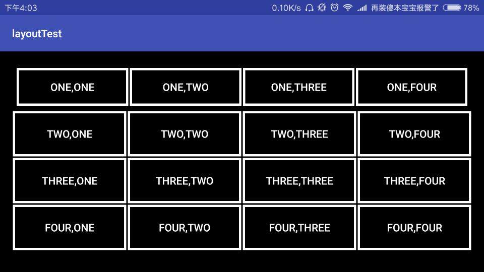
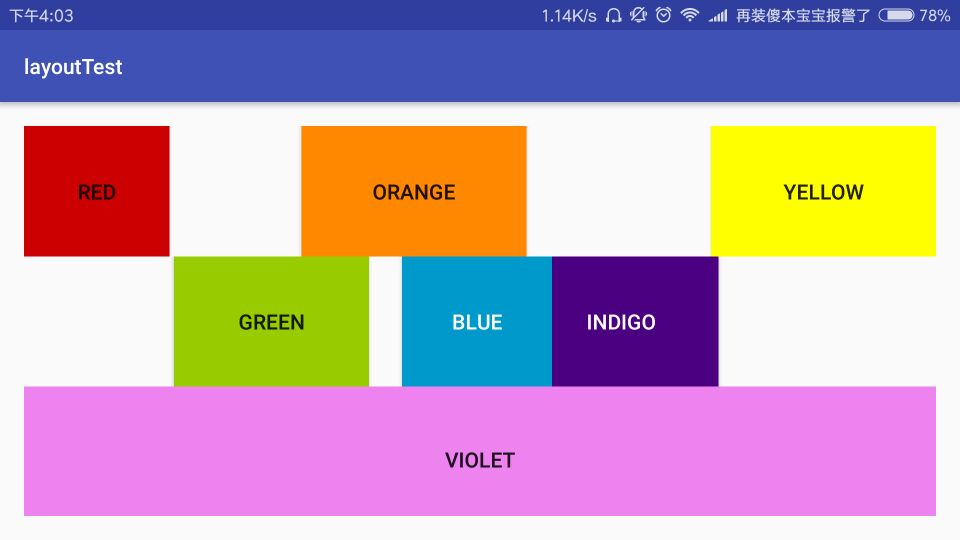
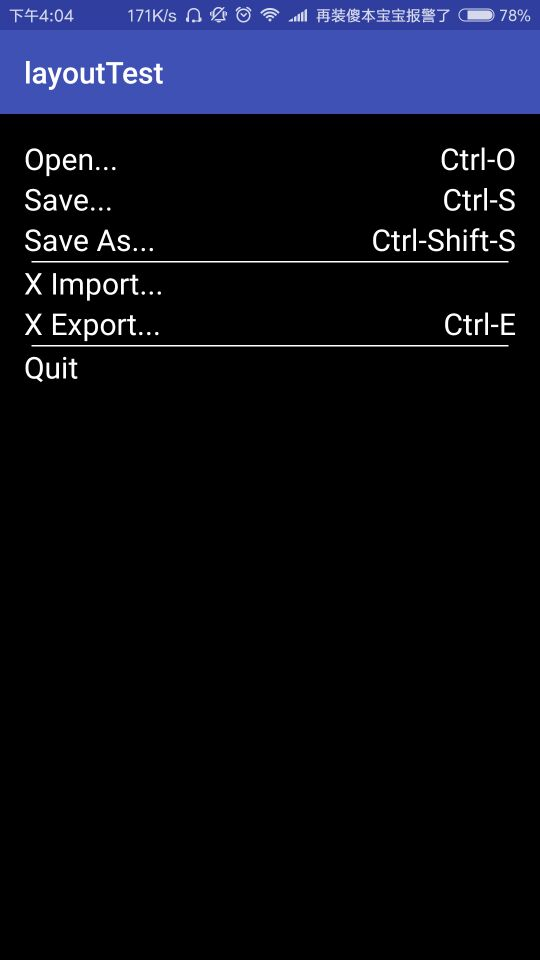

# Project layoutTest.
The project is a test for testing LinearLayout(vertical orientation style and 
horizontal orientation style),RelativeLayout and TableLayout.


## Test the LinearLayout.

* Set button style,make a xml file in drawable.
 
```xml
<?xml version="1.0" encoding="UTF-8"?>
<layer-list xmlns:android="http://schemas.android.com/apk/res/android">

    <!-- 边框颜色值 -->
    <item>
    <shape>
        <solid android:color="@android:color/white" />
    </shape>
</item>
    <!-- 主体背景颜色值,控件间的间距 -->
    <item
        android:bottom="3dp"
        android:top="3dp"
        android:left="3dp"
        android:right="3dp">
        <shape>
            <solid android:color="@android:color/black" />
        </shape>
    </item>

</layer-list>

```
* Use the style in button.
```xml
<Button
                android:text="One,One"
                android:layout_width="match_parent"
                android:layout_height="match_parent"
                android:id="@+id/btn_pos11"
                android:background="@drawable/btn_styles"
                android:textColor="@android:color/white"
                android:layout_marginLeft="1dp"
                android:layout_marginRight="1dp"

                android:layout_weight="1" />
```

* Set a linearLayout style : a vertical linearLayout take on four horizontal(the same of weight).
* Set the buttons in this style.
* Preview:


## Test the RelativeLayout.

* Set the layout style: a vertical linearLayout take on three relativeLayout.
* Preview:


## Test TableLayout.

* Set the layout style: a tableLayout take on eight tableRows,because the table have 8 rows.
* Preview:
* 


## author
* Name:Luis
* Email:[@Luis](1396954967@qq.com)
* QQ:1396954967
* CSDN:[fjnuLuis](http://blog.csdn.net/lin_13969)
