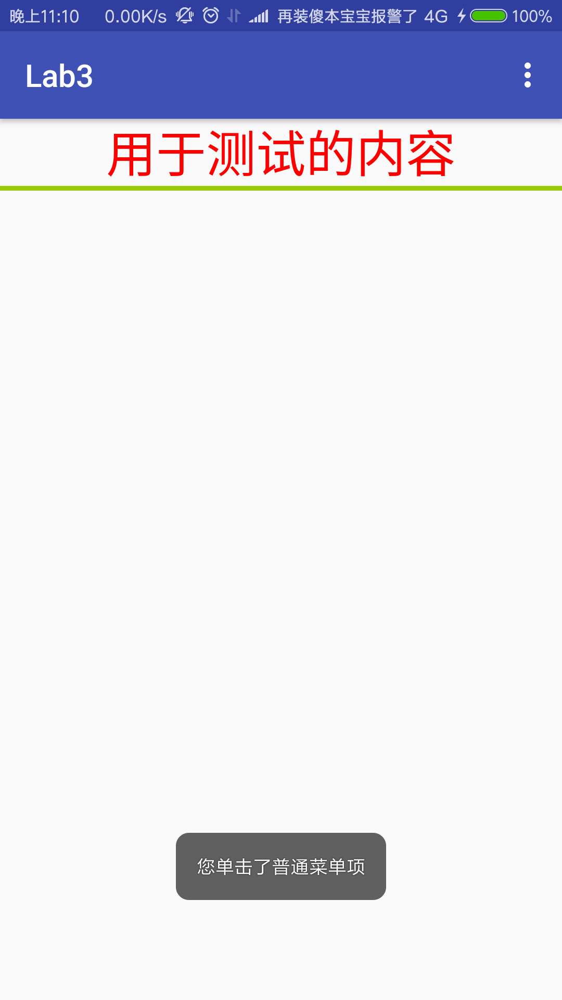

# Project SimpleAdaptTest.
The project is testing about using Listview ,SimpleAdapter and Toast.

---
## Implement the Listview.

* Set the listview style in the main_activity.xml.
 
```xml
<?xml version="1.0" encoding="UTF-8"?>
<ListView
        android:id="@+id/myList"
        android:layout_height="wrap_content"
        android:layout_width="match_parent"
        />
```
* Set the Listitem style in a new layout xml.
```xml
<?xml version="1.0" encoding="UTF-8"?>
<RelativeLayout xmlns:android="http://schemas.android.com/apk/res/android"
    android:layout_width="match_parent"
    android:layout_height="match_parent">


    <TextView
        android:id="@+id/name"
        android:layout_width="wrap_content"
        android:layout_height="wrap_content"
        android:textSize="30sp"
        android:textColor="#f0f"
        android:paddingLeft="10dp"
         />

    <ImageView
        android:id="@+id/header"
        android:layout_width="60dp"
        android:layout_height="40dp"
        android:paddingLeft="10dp"
        android:scaleType="fitXY"
        android:layout_alignParentTop="true"
        android:layout_alignParentRight="true"
        android:layout_alignParentEnd="true" />


</RelativeLayout>
```

* Import the data into Listview.

```Android
 SimpleAdapter simpleAdapter = new SimpleAdapter(this, listItems,
                R.layout.simple_item,
                new String[]{"header", "name"},
                new int[]{R.id.header,R.id.name});
        ListView list=(ListView) findViewById(R.id.myList);
        list.setAdapter(simpleAdapter);
```
---

## Import the exist picture into project.

* Copy resource into the folder: WORKSPACE/PROJECT_NAME/app/src/main/res/drawable,and use them by name,
     because the drawable will load the picture automatically. 


```Android
private int[] imageIds = new int[]
            {R.drawable.lion,R.drawable.tiger,R.drawable.monkey,
            R.drawable.dog,R.drawable.cat,R.drawable.elephant};
```

---

## Implement the toast.

* Using this function in anywhere anytime you want to show a toast.If you want to know 
    how to use this function, you need to look for the android API.

```Android
Toast.makeText(MainActivity.this,
                        names[position],Toast.LENGTH_SHORT).show();
```

---
## Preview


---
# Making a alertDialog.

##  1.Create a xml to make a layout style.
```xml
<?xml version="1.0" encoding="utf-8"?>
<LinearLayout xmlns:android="http://schemas.android.com/apk/res/android"
    android:layout_width="match_parent"
    android:layout_height="match_parent"
    android:orientation="vertical">
    <ImageView
        android:src="@drawable/title"
        android:scaleType="fitXY"
        android:layout_width="match_parent"
        android:layout_height="wrap_content" />
    <EditText
        android:layout_width="match_parent"
        android:inputType=""
        android:hint="Username"
        android:layout_height="wrap_content"
        android:id="@+id/username"/>
    <EditText
        android:inputType="numberPassword"
        android:hint="Password"
        android:layout_width="match_parent"
        android:layout_height="wrap_content" />
</LinearLayout>
```
## 2.Bind a button onclick event to show it.
```android
    public void showAlertDialog(View source){

        LinearLayout form=(LinearLayout)getLayoutInflater()
                .inflate(R.layout.alert_layout,null);
        new AlertDialog.Builder(this)
                .setView(form)
                .setPositiveButton("Sign in", new DialogInterface.OnClickListener() {
                    @Override
                    public void onClick(DialogInterface dialogInterface, int i) {

                    }

                })

                .setNegativeButton("Cancle", new DialogInterface.OnClickListener() {
                    @Override
                    public void onClick(DialogInterface dialogInterface, int i) {

                    }
                })
                .create()
                .show();
     }
```
## Preview


---
# Using XML file to make a menu.

## First of all, you need create a menu folder in res and a menu resource file in menu folder
## Next,you need make your menu style in this file.For example:
```xml
<?xml version="1.0" encoding="utf-8"?>
<menu xmlns:android="http://schemas.android.com/apk/res/android">
    <item android:title="字体大小">
        <menu>
            <item android:title="大"
                android:id="@+id/fontBig"/>
            <item android:title="中"
                android:id="@+id/fontMedium"/>
            <item android:title="小"
                android:id="@+id/fontSmall"/>
        </menu>

    </item>

    <item android:title="普通菜单项"
        android:id="@+id/common"/>
    <item android:title="字体颜色">
        <menu>
            <item android:title="红色"
                android:id="@+id/fontRed"/>
            <item android:title="黑色"
                android:id="@+id/fontBlack"/>
        </menu>
    </item>
</menu>

```
## finally,you can use this style in activity.
```android
    TextView textView;
    @Override
    protected void onCreate(Bundle savedInstanceState) {
        super.onCreate(savedInstanceState);
        setContentView(R.layout.activity_xmlmenu);

        textView=(TextView)findViewById(R.id.testContext);
        registerForContextMenu(textView);
    }

    @Override
    public boolean onCreateOptionsMenu(Menu menu){
        MenuInflater inflater = new MenuInflater(this);
        inflater.inflate(R.menu.menu_style,menu);
        return  super.onCreateOptionsMenu(menu);
    }

    @Override
    public boolean onOptionsItemSelected(MenuItem mi){
        if(mi.isCheckable())
            mi.setChecked(true);
        switch (mi.getItemId()){
            case R.id.fontBig:
                textView.setTextSize(20*2);
                break;
            case R.id.fontMedium:
                textView.setTextSize(16*2);
                break;
            case R.id.fontSmall:
                textView.setTextSize(10*2);
                break;
            case R.id.fontBlack:
                textView.setTextColor(Color.BLACK);
                break;
            case R.id.fontRed:
                textView.setTextColor(Color.RED);
                break;
            case R.id.common:
                Toast.makeText(XMLMenuActivity.this,
                        "您单击了普通菜单项",Toast.LENGTH_SHORT)
                        .show();
                break;

        }
        return  true;
    }

```
## Preview



---
# Using actionmode to create a context menu.

## 1.Create a layout to define a menu style.
```xml
?xml version="1.0" encoding="utf-8"?>
<RelativeLayout xmlns:android="http://schemas.android.com/apk/res/android"
    android:layout_width="match_parent"
    android:layout_height="match_parent">


    <TextView
        android:id="@+id/count"
        android:layout_width="wrap_content"
        android:layout_height="wrap_content"
        android:textSize="60sp"
        android:paddingLeft="10dp"
        android:layout_alignParentTop="true"
        android:layout_alignParentStart="true"
        android:layout_marginStart="84dp" />

    <ImageView
        android:id="@+id/pic"
        android:src="@drawable/and"
        android:layout_width="51dp"
        android:layout_height="53dp"
        android:paddingLeft="10dp"

        android:layout_alignBottom="@+id/count"
        android:layout_alignParentStart="true" />


</RelativeLayout>
```
## 2.Using this  xml in a adapter to bind the data.
```android
    private  String[] names=new String[]
            {"One","Two","Three","Four","Five","Six"};
    @Override
    protected void onCreate(Bundle savedInstanceState) {
        super.onCreate(savedInstanceState);
        setContentView(R.layout.activity_action_mode);


        List<Map<String, Object>> listItems = new ArrayList<Map<String, Object>>();
        for (int i = 0; i < names.length; i++) {
            Map<String, Object> listItem = new HashMap<String, Object>();
            listItem.put("count", names[i]);
            listItem.put("pic", R.drawable.and);
            listItems.add(listItem);
        }

        SimpleAdapter simpleAdapter = new SimpleAdapter(this, listItems,
                R.layout.action_layout,
                new String[]{"pic", "count"},
                new int[]{R.id.pic,R.id.count});
        ListView list=(ListView) findViewById(R.id.listAction);

        list.setAdapter(simpleAdapter);
        ...
    }
```
## 3.now ,Implement the MultiChoiceModeListener.
```android
class MultiModeCallback implements ListView.MultiChoiceModeListener {

        @Override
        public void onItemCheckedStateChanged(android.view.ActionMode mode, int position, long id, boolean checked) {

        }

        @Override
        public boolean onCreateActionMode(android.view.ActionMode mode, Menu menu) {


            mode.setTitle("Select Items");

            mode.setSubtitle(pos+"selected");

            return true;
        }

        @Override
        public boolean onPrepareActionMode(android.view.ActionMode mode, Menu menu) {
            return false;
        }

        @Override
        public boolean onActionItemClicked(android.view.ActionMode mode, MenuItem item) {

            return false;
        }

        @Override
        public void onDestroyActionMode(android.view.ActionMode mode) {

        }
    }
```
## 4.Set the mode and Listener.
```android
    list.setChoiceMode(ListView.CHOICE_MODE_MULTIPLE_MODAL);
    list.setMultiChoiceModeListener(new MultiModeCallback());
```
## Preview


---
## author
* Name:Luis
* Email:[@Luis](1396954967@qq.com)
* QQ:1396954967
* CSDN:[fjnuLuis](http://blog.csdn.net/lin_13969)