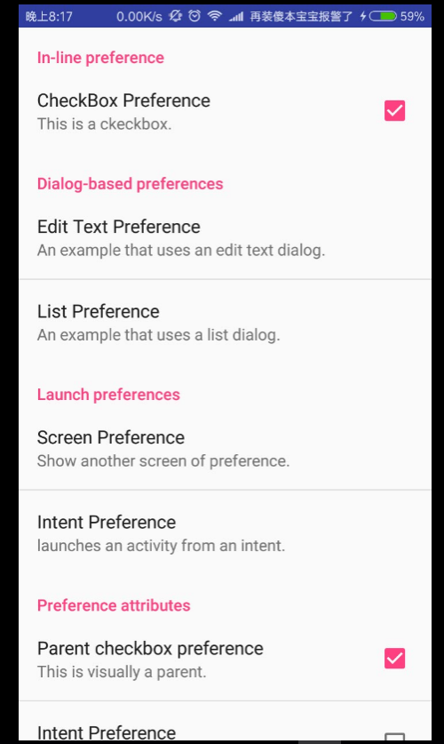
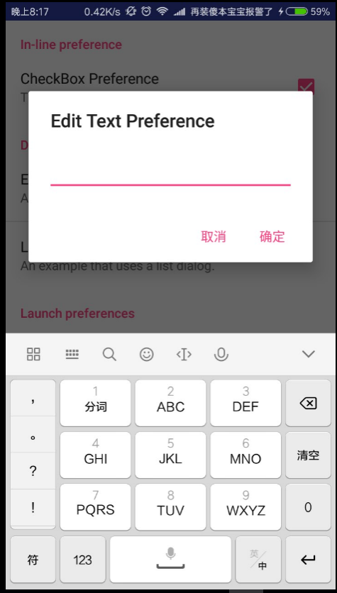
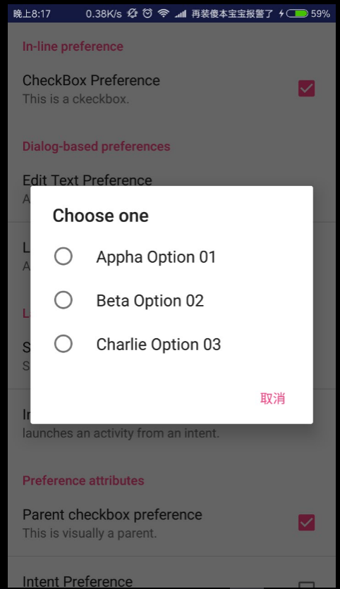
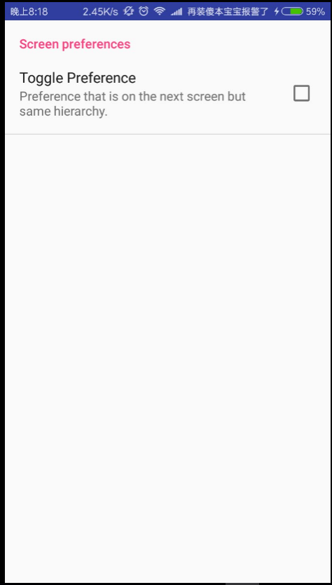

# Extended Activity.

This project is implementing how to use preference activity ,create a preference screen xml and associated with them without preference headers xml.

---

## Preparation. 
1. Create a android resource directory(named as xml and valued as xml) in res directory.
2. Create a xml resource file(In this project, it is named as 'preference.xml') in this directory.


## Making style in preference.xml.
-    Using PreferenceCategory label to classify different preference.
-    Using CheckBoxPreference label to make a preference having a checkbox within.
```android
res/xml/preference.xml:

    <PreferenceCategory android:title="In-line preference">
        <CheckBoxPreference
            android:title="CheckBox Preference"
            android:summary="This is a ckeckbox." />
    </PreferenceCategory>
```
-    Using ListPreference label to define the dialog information.
-    The entries define the list of name and entryValues define the list of value.You need create a xml named (like array.xml) in res/values and declare the array name.
```xml
res/values/array.xml:

<resources>
    <string-array name="choose_name_list">
        <item>Appha Option 01</item>
        <item>Beta Option 02</item>
        <item>Charlie Option 03</item>
    </string-array>
    <string-array name="choose_value_list">
        <item>001</item>
        <item>002</item>
        <item>003</item>
    </string-array>
</resources>
```
```android
res/xml/preference.xml:

<ListPreference
            android:dialogTitle="Choose one"
            android:entries="@array/choose_name_list"
            android:entryValues="@array/choose_value_list"
            android:title="List Preference"
            android:summary="An example that uses a list dialog." />
```
-    Using PreferenceScreen label in PreferenceScreen could make an intent or a new PreferenceScreen be called by system automatically. 
```android
res/xml/preference.xml:

<PreferenceCategory android:title="Launch preferences">
    <PreferenceScreen
        android:title="Screen Preference"
        android:summary="Show another screen of preference." >
        <PreferenceCategory android:title="Screen preferences">
            <CheckBoxPreference
                android:title="Toggle Preference"
                android:summary="Preference that is on the next screen but same hierarchy." />
        </PreferenceCategory>

        </PreferenceScreen>
    <PreferenceScreen
        android:title="Intent Preference"
        android:summary="launches an activity from an intent.">

        <intent android:action="android.intent.action.VIEW"
            android:data="http://www.baidu.com" />

    </PreferenceScreen>
</PreferenceCategory>
```
-   Using dependency attribute to define two checkboxs' paternity.
```android
res/xml/preference.xml:

    <PreferenceCategory android:title="Preference attributes">
        <CheckBoxPreference
            android:key="chk_parent"
            android:title="Parent checkbox preference"
            android:summary="This is visually a parent." />
        <CheckBoxPreference
            android:dependency="chk_parent"
            android:title="Intent Preference"
            android:summary="This is visually a child." />


    </PreferenceCategory>
```
## Preview for preference.xml:



---

## Linking to Activity.
1. Define a static class extend PreferenceFragment and override the onCreate function.
```android
public static class PrefsFragment extends PreferenceFragment {

        @Override
        public void onCreate(Bundle savedInstanceState) {
            super.onCreate(savedInstanceState);

            // Load the preferences from an XML resource
            addPreferencesFromResource(R.xml.preferences);
        }
    }
```
2.Using this class in MainActivity.
```android
 @Override
    protected void onCreate(Bundle savedInstanceState) {
        super.onCreate(savedInstanceState);
        FragmentManager mFragmentManager = getFragmentManager();
        FragmentTransaction mFragmentTransaction = mFragmentManager
                .beginTransaction();
        PrefsFragment mPrefsFragment = new PrefsFragment();
        mFragmentTransaction.replace(android.R.id.content, mPrefsFragment);
        mFragmentTransaction.commit();

    }
```

## Preview


---

## author
* Name:Luis
* Email:[@Luis](1396954967@qq.com)
* QQ:1396954967
* CSDN:[fjnuLuis](http://blog.csdn.net/lin_13969)


