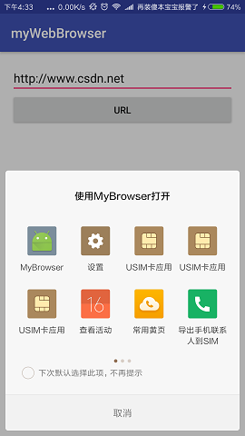

# Intent Call Another Program.
This project will make two programs:
-    1.Making a program to send a url to browser.
-    2.Making a program to recive this url and brow it.

---
## Sending URL Test Program:
- Edit the xml : Add a editText and Button.
```xml
 <EditText
        android:layout_width="match_parent"
        android:layout_height="wrap_content"
        android:id="@+id/edit"
        />
    <Button
        android:text="URL"
        android:layout_width="match_parent"
        android:layout_height="wrap_content"
        android:id="@+id/btn"
        android:layout_below="@+id/edit"
        android:layout_alignParentEnd="true" />

```
- Binding a Listener(OnClickListener) on this button.
```android
    Button btn = (Button) findViewById(R.id.btn);
    btn.setOnClickListener(new View.OnClickListener() {
        @Override
        public void onClick(View view) {
            Intent intent = new Intent();
            EditText text = (EditText) findViewById(R.id.edit);
            //获取editText内容
            String data =text.getText().toString();
            //设置Action为Action.View
            intent.setAction(Intent.ACTION_VIEW);
            //将URL放到bundle中
            intent.putExtra("url",data);
            startActivity(intent);
        }
    });
```

---

## Using WebView Component To Make A Browser:
- Edit the xml : Add a WebView Component.
```xml
 <WebView
        android:id="@+id/myWebView"
        android:layout_width="wrap_content"
        android:layout_height="wrap_content"
        android:layout_alignParentBottom="true"
        android:layout_alignParentEnd="true"
        android:layout_alignParentTop="true"
        android:layout_alignParentStart="true" />
```
- Init WebView To Loading URL.
1. Get Intent to get url data in bundle.
```android
    WebView webView = (WebView) findViewById(R.id.myWebView);
    Intent intent=getIntent();
    Bundle bundle =intent.getExtras();
    String url=null;
    if(bundle!=null&&bundle.containsKey("url")) {
        url = bundle.getString("url");
    
```
2.Set the WebSetting about making js enable to show.
```android
WebSettings settings = webView.getSettings();
    settings.setJavaScriptEnabled(true);
```
3.Override URLLoading function and load url.
```android
    webView.setWebViewClient(new WebViewClient(){
            @Override
            public boolean shouldOverrideUrlLoading(WebView view, String url) {
                view.loadUrl(url);
                return true;
            }
        });
    webView.loadUrl(url);
```
4.Finally,Set intent-filter and permission in AndroidMainifest.xml.
```xml
 <intent-filter>
    <action android:name="android.intent.action.MAIN" />
    <action android:name="android.intent.action.VIEW" />

    <category android:name="android.intent.category.LAUNCHER" />
    <category  android:name="android.intent.category.DEFAULT"/>

</intent-filter>
```
```xml
<uses-permission android:name="android.permission.INTERNET"/>
```

---
## Proview



---
## author
* Name:Luis
* Email:[@Luis](1396954967@qq.com)
* QQ:1396954967
* CSDN:[fjnuLuis](http://blog.csdn.net/lin_13969)