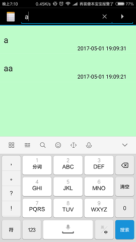
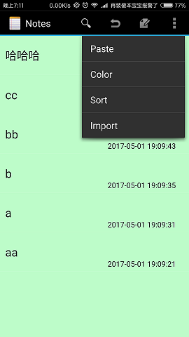
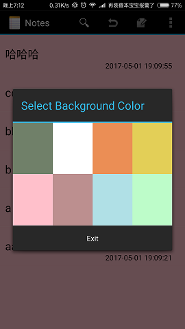
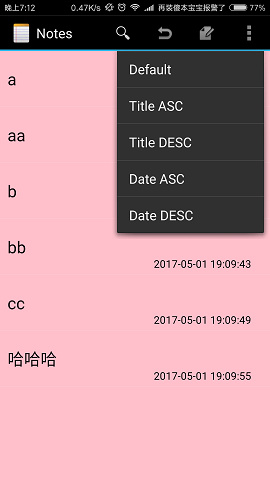
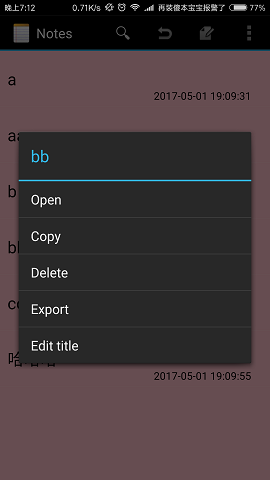
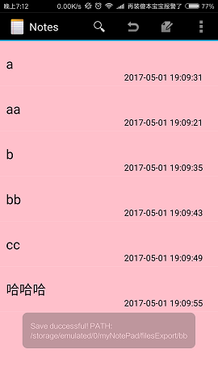
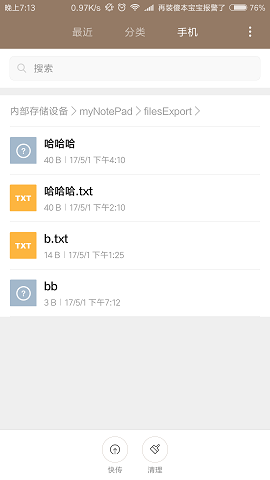
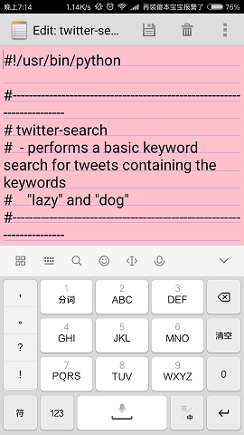

# NotePad应用
#### [HTML版md文件预览（浏览更便利）][1]
---
## 介绍
在做这个项目的时候，我是边做边记录自己是怎么思考的。我觉得也比较直白、通俗易懂，就直接把心得贴上去吧。写这个项目的时候比较弱鸡，什么都不懂，但是会参考该项目基本框架的源码，源码写的挺全的，依葫芦画瓢就行了。功能如下：
* [1.添加时间戳（基础功能）](#1)
* [2.模糊查询（基础功能）](#2)
* [3.修改背景色（附加功能）](#3)
* [4.排序（附加功能）](#4)
* [5.文件导出（附加功能）](#5)
* [6.文件导入（附加功能）](#6)

---
## 功能
* <h3 id="1">1.添加时间戳（基础功能）</h3>
找到ListActivity（就是NoteList）的ItemStyle -->lauout/notelist_item.xml，这个xml是定义ListView每个Item的样式，修改它就行了。里面是不是只有一个TextView，我改过了忘记了哈哈。不过好理解啊，你想要显示时间戳，那就再加个TextView。
我调好的Style：（各种调啊，然后现在才好看那么一丢丢，直接加会显示在右上角，或者左上角。）

```xml
<RelativeLayout
    xmlns:android="http://schemas.android.com/apk/res/android"
    android:layout_width="match_parent"
    android:layout_height="wrap_content"
    android:padding="5dp">

    <TextView xmlns:android="http://schemas.android.com/apk/res/android"
        android:id="@android:id/text1"
        android:layout_width="match_parent"
        android:textColor="@android:color/black"
        android:layout_height="?android:attr/listPreferredItemHeight"
        android:textAppearance="?android:attr/textAppearanceLarge"
        android:gravity="center_vertical"
        android:paddingLeft="5dip"
        android:singleLine="true"
    />
    <TextView
        android:layout_width="match_parent"
        android:layout_height="?android:attr/listPreferredItemHeight"
        android:id="@+id/cdate_text"
        android:textColor="@android:color/black"
        android:text="2017-04-26 20:20:20"
        android:layout_alignRight="@android:id/text1"
        android:paddingLeft="200dip"
        android:gravity="bottom"/>
</RelativeLayout>

```

改完这个xml，用起来吧。
进入notelist.java（主Activity嘛），哪里用呢？当然是加载数据的时候用的。加载数据的时候就是我们点击应用之后它就加载。。那就是OnCreate吧。进去瞅瞅呗。

```
 
        final Cursor cursor = managedQuery(
            getIntent().getData(),            // Use the default content URI for the provider.
            PROJECTION,                       // Return the note ID and title for each note.
            null,                             // No where clause, return all records.
            null,                             // No where clause, therefore no where column values.
          //  NotePad.Notes.DEFAULT_SORT_ORDER  // Use the default sort order.
           null
        );
```
这个游标就是用来查询数据库的，下面这个适配器就是用来显示数据的。我后面要用到这个SimpleCursorAdapter的修改游标的函数（重新绑定数据嘛）所以就变成成员变量了。

```
//成员变量：适配器
private SimpleCursorAdapter adapter;
...

// SimpleCursorAdapter adapter
adapter
    = new SimpleCursorAdapter(
                      this,                             // The Context for the ListView
                      R.layout.noteslist_item,          // Points to the XML for a list item
                      cursor,                           // The cursor to get items from
                      dataColumns,
                      viewIDs
    );
    
```
讲讲游标吧，这里有好几个参数，
PROJECTION：就是查询数据库的投影（说白了就是你要显示的东西），哇，那在这里直接写个时间不就行了。看看它数据库都存了什么嘛。

那就看NodePadProvider类吧：

```
public void onCreate(SQLiteDatabase db) {
           db.execSQL("CREATE TABLE " + NotePad.Notes.TABLE_NAME + " ("
                   + NotePad.Notes._ID + " INTEGER PRIMARY KEY,"
                   + NotePad.Notes.COLUMN_NAME_TITLE + " TEXT,"
                   + NotePad.Notes.COLUMN_NAME_NOTE + " TEXT,"
                   + NotePad.Notes.COLUMN_NAME_CREATE_DATE + " TEXT,"
                   //+ NotePad.Notes.COLUMN_NAME_CREATE_DATE + " INTEGER,"
                  // + NotePad.Notes.COLUMN_NAME_MODIFICATION_DATE + " INTEGER"
                   + NotePad.Notes.COLUMN_NAME_MODIFICATION_DATE + " TEXT"
                   + ");");
       }
```
哇，创建数据库的时候还加时间戳了，那就简单了哈哈哈，不用改数据库直接显示出来就行了。你看到那两行注释啊，是的，他默认存储的是时间戳，你要改数据库类型。改啥啊，直接改这里，卸载重装（类似删库）就行了哈哈哈。
但是我这里只改了类型，可是要改保存时候的值。
看看这里，很明显，契约类有定义这个时间戳，查一下给你看吧。（ALT-左键）NodePad类中：

```
/**
 * Column name for the creation timestamp
 * <P>Type: INTEGER (long from System.curentTimeMillis())</P>
 */
 public static final String COLUMN_NAME_CREATE_DATE = "created";

/**
 * Column name for the modification timestamp
 * <P>Type: INTEGER (long from System.curentTimeMillis())</P>
 */
 public static final String COLUMN_NAME_MODIFICATION_DATE = "modified";
```
完美。
人家用了契约类的值，就直接find一下就行了哈哈哈，看看它哪里用这个。。

```
//获取时间戳，并格式化时间
        SimpleDateFormat formatter    =   new    SimpleDateFormat    ("yyyy-MM-dd HH:mm:ss");
        Date curDate    =   new    Date(System.currentTimeMillis());//获取当前时间
        String    now    =    formatter.format(curDate);
        // Gets the current system time in milliseconds
      //  Long now = Long.valueOf(System.currentTimeMillis());

        // If the values map doesn't contain the creation date, sets the value to the current time.
        if (values.containsKey(NotePad.Notes.COLUMN_NAME_CREATE_DATE) == false) {
            values.put(NotePad.Notes.COLUMN_NAME_CREATE_DATE, now);
        }

        // If the values map doesn't contain the modification date, sets the value to the current
        // time.
        if (values.containsKey(NotePad.Notes.COLUMN_NAME_MODIFICATION_DATE) == false) {
            values.put(NotePad.Notes.COLUMN_NAME_MODIFICATION_DATE, now);
        }
```
哇，这个是long，改为自己格式化的字符串呗。可以了哈哈
再find 回到上面了，没了。可以了。
时间格式改好了，那就用呗。回到NoteList的PROJECTION
我们也用契约类的变量值，加一列吧。

```
private static final String[] PROJECTION = new String[] {
            NotePad.Notes._ID, // 0
            NotePad.Notes.COLUMN_NAME_TITLE, // 1
            NotePad.Notes.COLUMN_NAME_CREATE_DATE,//时间戳啊哈哈哈
    };
```
加完是有数据了，但是没绑定到Item中吧:
想到适配器是怎么绑定的：就是2个数组，一个保存列名（随便啊），一个保存控件ID，然后放入Adapter就行了哈。
想想那个SimpleCursorAdapter：
```
//成员变量：适配器
private SimpleCursorAdapter adapter;
...

// SimpleCursorAdapter adapter
adapter
    = new SimpleCursorAdapter(
                      this,                             // The Context for the ListView
                      R.layout.noteslist_item,          // Points to the XML for a list item
                      cursor,                           // The cursor to get items from
                      dataColumns,
                      viewIDs
    );
```
DataColumns不就是列名嘛，viewIDs不就是控件ID，
他们都在上面，改下呗。

```
String[] dataColumns = { NotePad.Notes.COLUMN_NAME_TITLE,
           NotePad.Notes.COLUMN_NAME_CREATE_DATE,//时间戳，这里名字直接用契约类的名字吧
        } ;
int[] viewIDs = { android.R.id.text1,
         R.id.cdate_text,//这个是时间戳控件ID
        };
```
时间戳显示就完成咯。


---

* <h3 id="2">2.模糊查询（基础功能）</h3>
查询的话本来是想能不能在第一行不绑定数据了改查询接口呢？但是这个本身是ListActivity，改成其他的可能需要改很多源码，就想下直接在菜单中添加一个按钮吧，点一下就展开，点一下又缩回去这样。那就找样式呗：

```xml
<!--  This is our one standard application action (creating a new note). -->
    <item android:id="@+id/menu_add"
          android:icon="@drawable/ic_menu_compose"
          android:title="@string/menu_add"
          android:alphabeticShortcut='a'
          android:showAsAction="always" />

    <!--  If there is currently data in the clipboard, this adds a PASTE menu item to the menu
          so that the user can paste in the data.. -->
    <item android:id="@+id/menu_paste"
          android:icon="@drawable/ic_menu_compose"
          android:title="@string/menu_paste"
          android:alphabeticShortcut='p' />

```
样式这里自带一个add 一个paste，妹子那天问我为啥点那个小点点只有一个paste，我当时不懂啊哈哈，乱说了一下。现在倒是懂了啊。上面那个showAsAction=always啊，设置这个菜单项一直显示在那，其它的被隐藏在右边的小列表里了。
那我就懂了，在这里加一个我的Item不就行了哈哈哈。

```xml
<!--搜索框菜单按钮。到NodeList里面就绑定成SearchView组件-->
    <item android:id="@+id/menu_search"
        android:icon="@drawable/ic_menu_compose"
        android:title="@string/menu_add"
        android:alphabeticShortcut='s'
        android:showAsAction="always" />
        <!-- 比较尴尬，这个是拿来还原搜索结果的菜单按钮，因为显示的数据只能通过修改游标才能还原，
    不然就无法显示所有的数据了-->
    <item android:id="@+id/menu_all"
        android:icon="@drawable/ic_menu_revert"
        android:title="@string/menu_add"
        android:alphabeticShortcut='A'
        android:showAsAction="always"
        />
```
Title啊我都没改，但是不能删啊，反正也不显示就放着嘛。
你会问不是只有一个Item就行了吗？我也比较尴尬啊，不懂先放着嘛，待会说啊。

看看人家怎么设置这个SearchView吧：
http://blog.csdn.net/xiaoshubing/article/details/50462689

借鉴别人的方法，来到NoteList，创建一个SearchView成员变量：

```
//成员变量：SearchView组件
    private SearchView searchView;
```
看他博客是在onCreateOptionsMenu
里面初始化样式的，就跟着做呗。
```
@Override
    public boolean onCreateOptionsMenu(Menu menu) {
        // Inflate menu from XML resource
        MenuInflater inflater = getMenuInflater();
        inflater.inflate(R.menu.list_options_menu, menu);
        setSearchView(menu);//添加搜索框
        ...
```
```
 /**
     * 设置查询菜单项
     * @param menu
     */
    private void setSearchView(Menu menu) {
        //1.找到menuItem并动态设置SearchView
        MenuItem item = menu.getItem(0);
        searchView = new SearchView(this);
        item.setActionView(searchView);

        //2.设置搜索的背景为白色
        if (Build.VERSION.SDK_INT >= Build.VERSION_CODES.ICE_CREAM_SANDWICH) {
            item.collapseActionView();
        }
        searchView.setQuery("", false);
        //searchView.setBackgroundResource(R.drawable.ic_menu_edit);
        //3.设置为默认展开状态，图标在外面
        searchView.setIconifiedByDefault(true);
        searchView.setQueryHint("Search");
        

```
这下面这句就不要跟着抄了，重载下2个函数，我也不知道是这两个函数，阴差阳错弄个Listener就自己跑出来这两个哈哈哈
```
searchView.setOnQueryTextListener(new SearchView.OnQueryTextListener() {
            @Override
            public boolean onQueryTextSubmit(String query) {
                //如果提交查询文本非空，收缩擦查询框
                if (Build.VERSION.SDK_INT >= Build.VERSION_CODES.ICE_CREAM_SANDWICH) {
                    searchView.onActionViewCollapsed();
                }
                return false;
            }

            @Override
            public boolean onQueryTextChange(String newText) {
                if(!"".equals(newText)) {
                    //where条件
                    String selection = NotePad.Notes.COLUMN_NAME_TITLE +" like ?";
                    String[] args = new String[]{newText+"%"};//条件的参数
                    Cursor cursor = getContentResolver().query(getIntent().getData(),
                            PROJECTION,selection,args,null);
                    //重新绑定游标
                    adapter.swapCursor(null);
                    adapter.swapCursor(cursor);
                }
                return false;
            }
        });


        searchView.setSubmitButtonEnabled(true);
    }
```
看到那个查询语句了嘛，TITLE like 查询的text就行了，然后切换一下游标，这个和其他语言重新绑定数据源一样的效果。

上面的效果已经好了啊，你要问我为啥是getContentResolver()啥的。看源码啊。我说这个NoteList很重要，其实好多操作就已经在这里有过了嘛。想想看嘛，你长按那个data，就出现一个菜单，有个删除，删除的时候要不要重新更新一下表啊。看看人家怎么写的呗。

```
case R.id.context_delete:
  
            // Deletes the note from the provider by passing in a URI in note ID format.
            // Please see the introductory note about performing provider operations on the
            // UI thread.
            getContentResolver().delete(
                noteUri,  // The URI of the provider
                null,     // No where clause is needed, since only a single note ID is being
                          // passed in.
                null      // No where clause is used, so no where arguments are needed.
            );
```
直接写这句话，不用修改绑定不行？试过了，直接无法刷新条目了。为啥呢，发现它的URI比较奇怪

```
 // Appends the selected note's ID to the URI sent with the incoming Intent.
        Uri noteUri = ContentUris.withAppendedId(getIntent().getData(), info.id);
```
改成我们getIntent.getData()试试？直接崩了,直接删了所有的条目。果然我们家的URI比不上人家的URI，没有指定具体的ID，就相当于delete没有where条件限制。
算了算了，我这种方法更简单。（后来才知道，基本框架上的ContentProvider的insert、update、delete都有调用notifyChanges函数，它会自动刷新列表，那查询没有改动数据库，就没办法notifyChanges，自己手动绑定吧）

仿佛还有一个按钮没有说：menu_all。现在说会比较容易明白吧。有没有发现SearchView监听器两个重载函数中，有一个是TextChanged，这就麻烦了，Searchview要收缩肯定要清空搜索框文字。清空就搜索空了。搜索空串就会显示所有的条目吧，这里有2种做法：
1.	让它搜索呗。。那你关搜索框的时候就只能显示全部，搜索框会占用一整个menu，那就不能使用menu的功能了.
2.	屏蔽搜索空串，把显示全部的功能做到外面来。
我选择第二个。你才会看到我在TextChanged里面把空串屏蔽了。
那怎么做那个菜单Item的功能呢？同样还是看别人的代码。找menu_add:
```
case R.id.menu_add:
          /*
           * Launches a new Activity using an Intent. The intent filter for the Activity
           * has to have action ACTION_INSERT. No category is set, so DEFAULT is assumed.
           * In effect, this starts the NoteEditor Activity in NotePad.
           */
           startActivity(new Intent(Intent.ACTION_INSERT, getIntent().getData()));
```
在这里面加一个case就行了。
```
//还原显示所有的数据
        case R.id.menu_all:
          Cursor cursor = getContentResolver().query
                  (getIntent().getData(),PROJECTION,null,null,null);
          adapter.swapCursor(null);
          adapter.swapCursor(cursor);
            return true;
```
这里面whereClause和Args填空值就没有where了,就显示全部信息了。



---

* <h3 id="3">3.修改背景色（附加功能）</h3>
因为是自定义的颜色按钮（textView点击事件），用户偏好设置要自己保存到SharedPreferences，新建一个类，获取和保存SharedPreferences的键值对：

```
public class PreferencesService {
    private Context context;

    public PreferencesService(Context context) {
        this.context = context;
    }

    /**
     * 保存参数
     * @param color 颜色ID
     * @param sortType 排序类型
     */
    public void save(int color,int sortType) {
        //获得SharedPreferences对象
        SharedPreferences preferences = context.getSharedPreferences("pdata", Context.MODE_PRIVATE);
        SharedPreferences.Editor editor = preferences.edit();
        editor.putInt("color", color);
        editor.putInt("sort", sortType);
        editor.commit();
    }

    /**
     * 获取各项参数
     * @return
     */
    public Map<String, String> getPerferences() {
        Map<String, String> params = new HashMap<String, String>();
        SharedPreferences preferences = context.getSharedPreferences("pdata", Context.MODE_PRIVATE);
        params.put("color", String.valueOf(preferences.getInt("color", 0)));
        params.put("sort", String.valueOf(preferences.getInt("sort", 0)));
        return params;
    }

}

```
list_options_menu添加颜色菜单，其实就是在右上角列表里的一个按钮:

```xml
<!-- 背景颜色 -->
    <item android:id="@+id/menu_color"
        android:title="@string/menu_color"
        android:alphabeticShortcut='c' />
```
NoteList里添加一个操作配置文件和一个属性保存背景颜色值的属性：
```
//偏好设置
private PreferencesService service;
//背景颜色
private int color;
```
NoteList-->OnCreate加载时需要加载配置文件，并获取配置文件中的颜色值

```
//设置背景色
        service = new PreferencesService(this);
        //获取配置文件的键值对
        Map<String, String> params = service.getPerferences();
        //获取颜色值
        String value = params.get("color");
        if(!"0".equals(value))
            color= Integer.parseInt(value);
        else
            color = R.drawable.bkwhite;
        //修改背景颜色
        Resources res = getResources();
        Drawable bdrawable = res.getDrawable(color);
        this.getListView().setBackgroundDrawable(bdrawable);
```
这个只是初始化，那在哪里修改呢？刚才不是添加一个列表上的按钮嘛，肯定是那个的点击事件触发一个AlertDialog，提供用户选择嘛。找到那个按钮注册点击事件的地方吧。同样跟那个还原数据按钮一样的地方注册：

```
//点击颜色菜单，弹窗颜色选择框
            case R.id.menu_color:
                //设置自定义布局
                LinearLayout form=(LinearLayout)getLayoutInflater()
                        .inflate(R.layout.color_style,null);
                final AlertDialog dialog=new AlertDialog.Builder(this)
                        .setView(form)//加载布局
                        .setTitle(R.string.title_color_list)//设置标题
                        .setPositiveButton("Exit", new DialogInterface.OnClickListener() {//退出按钮
                    @Override
                    public void onClick(DialogInterface dialog, int which) {
                    }

                })
                .create();
                dialog.show();
                //更新背景颜色
                setTextViewOnclick(dialog);
                return true;
```
如何使用户点击一个颜色，背景颜色就改变呢？其实不用太复杂地交互，只要主Activity里有个修改背景的函数就行了，主Activity不存在什么匿名内部类难找调用的类，因此我是这么做的，修改背景颜色交给主Activity来做就行了，你传一个要修改的颜色：

```
/**
     * 设置背景颜色并保存
     * @param color 颜色值
     */
    private void setColor(int color){
        //修改背景颜色
        Resources res = getResources();
        Drawable drawable = res.getDrawable(color);
        getListView().setBackgroundDrawable(drawable);
        //修改属性值
        this.color = color;
        //保存到配置文件
        service.save(color,sortType);
    }

    /**
     * 绑定颜色按钮点击事件
     * @param dialog 对话框
     */
    private void setTextViewOnclick(final AlertDialog dialog){
        //获取颜色控件
        TextView color_a = (TextView)dialog.getWindow().findViewById(R.id.color_a);
        TextView color_b = (TextView)dialog.getWindow().findViewById(R.id.color_b);
        TextView color_c = (TextView)dialog.getWindow().findViewById(R.id.color_c);
        TextView color_d = (TextView)dialog.getWindow().findViewById(R.id.color_d);
        TextView color_e = (TextView)dialog.getWindow().findViewById(R.id.color_e);
        TextView color_f = (TextView)dialog.getWindow().findViewById(R.id.color_f);
        TextView color_g = (TextView)dialog.getWindow().findViewById(R.id.color_g);
        TextView color_h = (TextView)dialog.getWindow().findViewById(R.id.color_h);
        //设置颜色点击事件监听
        color_a.setOnClickListener(new View.OnClickListener() {
            @Override
            public void onClick(View v) {
                setColor(R.drawable.bkshibanhui);
            }
        });
        color_b.setOnClickListener(new View.OnClickListener() {
            @Override
            public void onClick(View v) {
                setColor(R.drawable.bkwhite);
            }
        });

        color_c.setOnClickListener(new View.OnClickListener() {
            @Override
            public void onClick(View v) {
                setColor(R.drawable.bkdougello);
            }
        });
        color_d.setOnClickListener(new View.OnClickListener() {
            @Override
            public void onClick(View v) {
                setColor(R.drawable.bkbanana);
            }
        });
        color_e.setOnClickListener(new View.OnClickListener() {
            @Override
            public void onClick(View v) {
                setColor(R.drawable.bkfenhong);
            }
        });
        color_f.setOnClickListener(new View.OnClickListener() {
            @Override
            public void onClick(View v) {
                setColor(R.drawable.bkmeiguihong);
            }
        });
        color_g.setOnClickListener(new View.OnClickListener() {
            @Override
            public void onClick(View v) {
                setColor(R.drawable.bkqianhuilan);
            }
        });
        color_h.setOnClickListener(new View.OnClickListener() {
            @Override
            public void onClick(View v) {
                setColor(R.drawable.bkbohe);
            }
        });

    }
```
编辑框的背景同步？一样的，只要在NodeEditor-->OnCreate加载的时候读取配置文件就行了：

```

        service = new PreferencesService(this);
        //获取键值对
        Map<String, String> params = service.getPerferences();
        //获取键color的值
        String value = params.get("color");
        int color;
        if(!"0".equals(value))
            color= Integer.parseInt(value);
        else
            color = R.drawable.bkwhite;
        //修改背景颜色
        Resources res = getResources();
        Drawable bdrawable = res.getDrawable(color);
        this.getWindow().setBackgroundDrawable(bdrawable);
```




---
* <h3 id="4">4.排序（附加功能）</h3>
前面那个SharedPreferences个里已经定义了sort类型了，就可以直接set进去。先弄排版吧，也是右上角列表（list_options_menu）添加一个小菜单：
```xml
!-- 排序菜单列表-->
    <item android:title="@string/menu_sort">
        <menu>
            <!-- 默认按修改时间降序，见NotePad契约类-->
            <item android:title="@string/menu_sort_default"
                android:id="@+id/sort_default" />
            <!-- 标题升序-->
            <item android:title="@string/menu_sort_title_asc"
                android:id="@+id/sort_title_asc"/>
            <!-- 标题降序-->
            <item android:title="@string/menu_sort_title_desc"
                android:id="@+id/sort_title_desc" />
            <!-- 创建时间升序-->
            <item android:title="@string/menu_sort_date_asc"
                android:id="@+id/sort_date_asc" />
            <!-- 创建时间降序-->
            <item android:id="@+id/sort_date_desc"
                android:title="@string/menu_sort_date_desc" />
        </menu>
    </item>
```
添加属性并在OnCreate加载配置：
```
//排序类型
    private int sortType;
    ...
    
    //获取排序值
    value = params.get("sort");
    sortType = Integer.parseInt(value);
```
排序类型先在NotePad中写个契约类吧：
```
public static final class SortType implements BaseColumns{
        /**
         * 排序类型契约：
         * SORT_DEFALUT 默认排序，即修改时间降序
         * SORT_TITLE_ASC 标题升序
         * SORT_TITLE_DESC 标题降序
         * SORT_CREATEDATE_ASC 创建时间升序
         * SORT_CREATEDATE_DESC 创建时间降序
         */
        public static final  int  SORT_DEFALUT=0;
        public static final  int  SORT_TITLE_ASC=1;
        public static final  int  SORT_TITLE_DESC=2;
        public static final  int  SORT_CREATEDATE_ASC=3;
        public static final  int  SORT_CREATEDATE_DESC=4;
    }
```
写个函数返回排序字符串：
```
/**
     * 获取排序类型
     * @param type 排序类型
     * @return 返回数据库排序字符串
     */
    private String getSortType(int type){
        if(type == NotePad.SortType.SORT_TITLE_ASC)//标题升序
            return NotePad.Notes.COLUMN_NAME_TITLE + " ASC";
        if(type == NotePad.SortType.SORT_TITLE_DESC)//标题降序
            return NotePad.Notes.COLUMN_NAME_TITLE + " DESC";
        if(type == NotePad.SortType.SORT_CREATEDATE_ASC)//创建时间升序
            return NotePad.Notes.COLUMN_NAME_CREATE_DATE + " ASC";
        if(type == NotePad.SortType.SORT_CREATEDATE_DESC)//创建时间降序
            return NotePad.Notes.COLUMN_NAME_CREATE_DATE + " DESC";
        else//默认
            return NotePad.Notes.DEFAULT_SORT_ORDER;
    }

```
接下来就是哪里使用Cursor哪里把排序字符串修改过去就行了。
```
final Cursor cursor = managedQuery(
            getIntent().getData(),            // Use the default content URI for the provider.
            PROJECTION,                       // Return the note ID and title for each note.
            null,                             // No where clause, return all records.
            null,                             // No where clause, therefore no where column values.
          //  NotePad.Notes.DEFAULT_SORT_ORDER  // Use the default sort order.
            getSortType(sortType)//排序类型
        );
        
        ...

Cursor cursor = getContentResolver().query(getIntent().getData(),
                            PROJECTION,selection,args,getSortType(sortType));
                    //重新绑定游标
                    adapter.swapCursor(null);

```
不止这些哦，一定要全改。接下来就是设置右上角按钮的点击（其实就是点击就保存排序类型到配置文件，修改那个sortType变量）:
```
//排序偏好设置
            case R.id.sort_default://默认，修改时间降序
                sortType=NotePad.SortType.SORT_DEFALUT;//修改属性值
                service.save(color,sortType);//保存键值对
                return true;
            case R.id.sort_title_asc://标题升序
                sortType=NotePad.SortType.SORT_TITLE_ASC;
                service.save(color,sortType);
                return true;
            case R.id.sort_title_desc://标题降序
                sortType=NotePad.SortType.SORT_TITLE_DESC;
                service.save(color,sortType);
                return true;
            case R.id.sort_date_asc://创建时间升序
                sortType=NotePad.SortType.SORT_CREATEDATE_ASC;
                service.save(color,sortType);
                return true;
            case R.id.sort_date_desc://创建时间降序
                sortType=NotePad.SortType.SORT_CREATEDATE_DESC;
                service.save(color,sortType);
                return true;
```



---

* <h3 id="5">5.文本导出（附加功能）</h3>
试过listView多选模式，需要定制背景样式，不然多选颜色看不清啊，所以就单文件导出吧。Low了点。
先把创建文件夹和文件的工具写好：
```
public class Tools {
    /**
     * 将字符串写入到文本文件中
     */
    public static void writeTxtToFile(String strcontent, String filePath,
                               String fileName) {
        // 生成文件夹之后，再生成文件，不然会出错
        makeFilePath(filePath, fileName);// 生成文件

        String strFilePath = filePath + fileName;
        // 每次写入时，都换行写
        String strContent = strcontent + "\n";
        try {
            File file = new File(strFilePath);
            if (!file.exists()) {//如果不存在就创建
                file.getParentFile().mkdirs();//创建目录
                file.createNewFile();//创建文件
            }else {//如果存在就删除重新创建
                file.delete();
                file.getParentFile().mkdirs();
                file.createNewFile();
            }
            RandomAccessFile raf = new RandomAccessFile(file, "rwd");
            //raf.seek(file.length());
            raf.write(strContent.getBytes());
            raf.close();
        } catch (Exception e) {
            Log.e("error:", e + "");
        }
    }

    /**
     * 生成文件
     */
    public static File makeFilePath(String filePath, String fileName) {
        File file = null;
        makeRootDirectory(filePath);// 生成文件夹
        try {
            file = new File(filePath + fileName);
            if (!file.exists()) {
                file.createNewFile();
            }
        } catch (Exception e) {
            e.printStackTrace();
        }
        return file;
    }

    /**
     * 生成文件夹
     */
    public static void makeRootDirectory(String filePath) {
        File file = null;
        try {
            file = new File(filePath);
            if (!file.exists()) {
                file.mkdir();
            }
        } catch (Exception e) {
            Log.i("error:", e + "");
        }
    }


}
```
在长按ListItem的菜单栏(list_context_menu)里加一个导出按钮：
```xml
 <item android:id="@+id/context_export"
          android:title="@string/menu_export" />
```
绑定点击事件（同样在NoteList查找context_copy,加个case）。
然而怎么查询选中的文本呢？看NoteEditor吧：
```
mCursor = managedQuery(
            mUri,         // The URI that gets multiple notes from the provider.
            PROJECTION,   // A projection that returns the note ID and note content for each note.
            null,         // No "where" clause selection criteria.
            null,         // No "where" clause selection values.
            null          // Use the default sort order (modification date, descending)
        );
...

if (mState == STATE_EDIT) {
                // Set the title of the Activity to include the note title
                int colTitleIndex = mCursor.getColumnIndex(NotePad.Notes.COLUMN_NAME_TITLE);
                String title = mCursor.getString(colTitleIndex);
                Resources res = getResources();
                ...
```
可见是先用Cursor去查询，然后获取投影（要显示的列）的列号（第几列），然后再通过getString获取。获取出来并保存。
```
//文件导出
        case R.id.context_export:
           //查询数据
            Cursor mCursor = managedQuery(
                    noteUri,
                    new String[]{NotePad.Notes.COLUMN_NAME_TITLE,
                            NotePad.Notes.COLUMN_NAME_NOTE},
                    null,
                    null,
                    null
            );
            //定位投影列
            int colNoteIndex = mCursor.getColumnIndex(NotePad.Notes.COLUMN_NAME_NOTE);
            int colTitleIndex = mCursor.getColumnIndex(NotePad.Notes.COLUMN_NAME_TITLE);
            mCursor.moveToFirst();//从下标-1移动到第一个位置
            String note = mCursor.getString(colNoteIndex);//获取文本
            String name = mCursor.getString(colTitleIndex);//获取标题
            //设置文件路径
            String filePath = Environment.getExternalStorageDirectory()
                    .getPath() + "/myNotePad/filesExport/";
            //设置文件名
            String fileName = name;
            //保存文件
            Tools.writeTxtToFile(note,filePath,fileName);
            //显示
            Toast.makeText(this,"Save duccessful! PATH:\n"+filePath +fileName,Toast.LENGTH_LONG).show();
            return true;
```
测试下不行。那就是缺少权限了，AndroidManifest.xml加一下：

```xml
 <uses-permission android:name="android.permission.WRITE_EXTERNAL_STORAGE"/>
```

注意，直接找根路径下/myNotePad/文件夹就行了，storage是个软链接。





---

* <h3 id="6">6.文件导入（附加功能）</h3>
加个按钮吧。。这个不属于某个ListItem，那还是加在右上角Menu里（list_options_menu）:

```xml
<!--导入按钮 -->
    <item android:title="@string/menu_import"
        android:id="@+id/menu_import" />
```
添加事件处理：

```
case R.id.menu_import://导入文件
                //通过intent调用系统文件浏览器选择并返回文件数据
                Intent intent = new Intent(Intent.ACTION_GET_CONTENT);
                intent.setType("text/*");//设置文件类型
                //为添加Action执行环境添加一个可打开的分类
                intent.addCategory(Intent.CATEGORY_OPENABLE);
                //调用Activity，并获取返回的数据
                startActivityForResult(intent,NotePad.DataTranfer.GET_DIR_CODE);
                return true;
```
重写OnActivityResult:
```
/**
     *获取被调用Activity所返回的结果
     * @param requestCode requestCode用于与startActivityForResult中的requestCode中值进行比较判断，是以便确认返回的数据是从哪个Activity返回的。
     * @param resultCode resultCode是由子Activity通过其setResult()方法返回。适用于多个activity都返回数据时，来标识到底是哪一个activity返回的值。
     * @param data 一个Intent对象，带有返回的数据。可以通过data.getXxxExtra( );方法来获取指定数据类型的数据
     */
    @Override
    protected void onActivityResult(int requestCode, int resultCode, Intent data) {

        super.onActivityResult(requestCode, resultCode, data);
        if(resultCode== Activity.RESULT_OK){
            if(requestCode==NotePad.DataTranfer.GET_DIR_CODE){
                //调用ReadFileFromURI函数保存文件
                ReadFileFromURI(data.getDataString());

            }
        }
    }
    
    
```
添加一个函数用来将URIFileName,Note数据库里面字段的值。前面是IO操作，最后一个是数据库操作。操作数据库需要查看NoteList的Insert操作:
```
 case R.id.menu_add:
          /*
           * Launches a new Activity using an Intent. The intent filter for the Activity
           * has to have action ACTION_INSERT. No category is set, so DEFAULT is assumed.
           * In effect, this starts the NoteEditor Activity in NotePad.
           */
           startActivity(new Intent(Intent.ACTION_INSERT, getIntent().getData()));
           return true;
```
打开NoteEditor,搜索动作ACTION_INSERT：
```
else if (Intent.ACTION_INSERT.equals(action)
                || Intent.ACTION_PASTE.equals(action)) {

            // Sets the Activity state to INSERT, gets the general note URI, and inserts an
            // empty record in the provider
            mState = STATE_INSERT;

            mUri = getContentResolver().insert(intent.getData(), null);
            ...
```
使用insert函数，照猫画虎吧（那个null是ContentValues，就是一个键值对，我们把title和Note内容传进去就行了）:
```
/**
     * 通过URI保存文件内容进数据库
    * @param uri Uri.toString()
    */
    public void ReadFileFromURI(String uri){
        Log.i("URI:",uri);
        //必须用decode，解析中文路径
        //去掉file://  7个字符
        uri = Uri.decode(uri);
        uri = uri.substring(7);
        Log.i("URI:",uri);
        File file = new File(uri);
        // if(!file.exists())return;
        String note = "";
        //IO流操作读取文件
        InputStreamReader isr = null;
        BufferedReader br = null;
        try {
            isr = new InputStreamReader(new FileInputStream(file), "UTF-8");
            br = new BufferedReader(isr);
            String line=null;
            while ((line =br.readLine()) != null) {
                note = note+line+"\n";
            }
        } catch (UnsupportedEncodingException e) {
            e.printStackTrace();
        } catch (FileNotFoundException e) {
            e.printStackTrace();
        } catch (IOException e) {
            e.printStackTrace();
        }finally {
            try {
                if(br != null) br.close();
                if(isr != null)isr.close();
            } catch (IOException e) {
                e.printStackTrace();
            }

        }
        Log.i("Name:",file.getName());
        Log.i("Note:",note);

        //保存文件
        ContentValues values = new ContentValues();//创建一个键值对容器
        values.put(NotePad.Notes.COLUMN_NAME_TITLE,file.getName());//放入标题
        values.put(NotePad.Notes.COLUMN_NAME_NOTE,note);//放入内容
        //执行insert函数
        Uri myUri=getContentResolver().insert(getIntent().getData(),values);

    }
```




---

## author
* Name:Luis
* Email:[@Luis](1396954967@qq.com)
* QQ:1396954967
* CSDN:[fjnuLuis](http://blog.csdn.net/lin_13969)

 [1]: https://fjnuluis.github.io/AndroidLabProject/lab_notepad/markdownToc.html